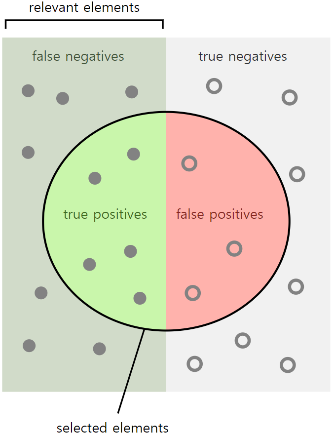

## Introduction

-  The detection and quantification of disease markers in imaging data is critical during diagnosis, and monitoring of disease progression, or treatment response. 
- Relying on the vocabulary of known markers limits the use of imaging data containing far richer relevant information.
- Extensive supervised training using large amounts of annotated data such as labeled lesions limits our ability to exploit imaging data for treatment decisions. 
- **We propose unsupervised learning to create a rich generative model of healthy local anatomical appearance. (GANs)**
  1. The central problem of creating a sufficiently representative model of appearance.
  2.  Improved technique for mapping from image space to latent space.
  3.  Differentiate between observations that conform to the training data and such data that does not fit.

## GAN

## Generative Adversarial Representation Learning to Identify Anomalies

- This method trains a generative model, and a discriminator to distinguish between generated and real data simultaneously. 
- Instead of a single cost function optimization, it aims at the Nash equilibrium of costs, increasing the representative power and specificity of the generative model, while at the same time becoming more accurate in classifying real- from generated data and improving the corresponding feature mapping.

## Unsupervised Manifold Learning of Normal Anatomical Variability

- $I_m$ : A set of $M$ medical images that showing healthy anatomy $(m=1,2,...,M)$.
- $$I_m\in\R^{a\times b}$$ : An intensity image of size a x b.
- $$\Chi=x_{k,m}\in\chi$$ : $$K$$ 2D image patches from each image $$I_m$$ ($$k=1,2,...,K$$)

#### Train

-  During training they trained the model with only given $$\langle I_m \rangle$$ and trained a generative adversarial model to learn the manifold $$X$$ , which represents the variability of the training images, in an unsupervised fashion. 

#### Test

- For testing, they used  $\langle y_n,l_n \rangle$ unseen images of size $c \times c$ extracted form new testing data $J$ and $$l_n \in \{0,1\}$$ is an array of binary image-wise ground-truth labels.

#### Optimize

- 
- During adversarial training the generator improves in generating realistic images and the discriminator progresses in correctly identifying real and generated images.

## Mapping new Images to the Latent Space

- Find $$\mu(x)=x \mapsto z$$ . Given a query image $$x$$,  find a best point $$z$$ that generates $$G(z)$$, which is most similar to the query image $$x$$.

  1. Randomly sampling  $$z_1$$ from the latent space distribution $$\Zeta$$ and feed it into the trained generator to get a generated image $$G(z_1)$$.
  2. Define a loss function base on $$G(z_1)$$ for which the update of the coefficients of $$z_1$$ via back-propagation steps.

- Residual Loss : It measures the visual dissimilarity between query image $$x$$ and generated image $$G(z_\gamma)$$ 

  - 

  - If images $$x$$ and $$G(z_\gamma)$$ are identical, the residual loss is zero.

- Discrimination Loss : They are inspired  by feature matching

  - Instead of optimizing the parameters of the generator via maximizing the discriminator’s output on generated examples, the generator is forced to generate data that has similar statistics as the training data
  - They proposed to use a richer intermediate feature representation of the discriminator
  - 
  - $$f(\cdot)$$ : The output of an intermediate layer of the discriminator
  - Based on this new loss term, the adaptation of the coordinates of $$z$$ does not only rely on a hard decision of the trained discriminator, whether or not a generated image $$G(z_γ)$$ fits the learned distribution of normal images, but instead takes the rich information of the feature representation, which is learned by the discriminator during adversarial training, into account.

- Overall loss
  

- Only the coefficients of z are adapted via back-propagation. The trained parameters of the generator and discriminator are kept fixed.

## Detection of Anomalies

- Anomaly score
  

-  The model yields a large anomaly score $$A(x)$$ for anomalous images, whereas a small anomaly score means that a very similar image was already seen during training. 
- The residual image is used for the identification of anomalous regions within an image.

## Experiments

### Data

- Train : 2D image patches extracted from 270 clinical OCT volumes of healthy subjects, which were chosen based on the criterion that the OCT volumes do not contain fluid regions.
- Test : Patches were extracted from 10 additional healthy cases and 10 pathological cases, which contained retinal fluid.

- They extracted in total 1.000.000 2D training patches with an image resolution of 64×64 pixels at randomly sampled positions. 

- The test set in total consisted of 8192 image patches and comprised normal and pathological samples from cases not included in the training set.

### Evaluation

1. Whether the model can generate realistic images.
2. The anomaly detection accuracy of our approach on images extracted from the annotated test set.
3. Compare with aCAE(an adversarial convolutional autoencoder) and with the reference discrimination score for evaluating the anomaly detection performance.
4. 

## Results

## Conclusion

- Our approach is able to detect different known anomalies, such as retinal fluid and HRF, which have never been seen during training.
- Results demonstrate good sensitivity and the capability to segment anomalies.